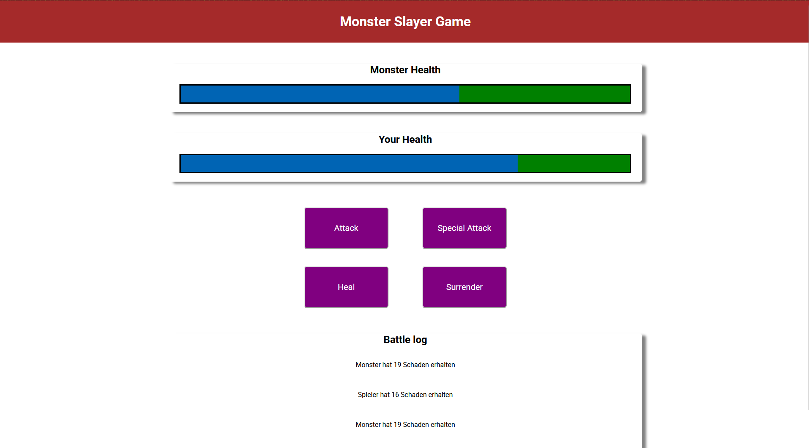

# Monster Slayer Game

Dieses Projekt ist im Rahmen eines Udemy-Kurses entstanden, den ich selbständig zur Weiterbildung im Bereich Vue.js absolviert habe. Ziel war es, die Grundlagen von Vue.js praktisch anzuwenden und ein kleines, interaktives Spiel zu entwickeln.

## Projektbeschreibung

Im Monster Slayer Game trittst du gegen ein Monster an. Du kannst angreifen, eine Spezialattacke ausführen oder dich heilen. Das Spiel zeigt die Lebenspunkte von Spieler und Monster sowie ein Battle-Log aller Aktionen an.

## Features

- Lebensbalken für Spieler und Monster
- Verschiedene Angriffs- und Heilaktionen
- Battle-Log zur Nachverfolgung aller Aktionen
- Einfache Benutzeroberfläche mit Vue-Komponenten

## Motivation

Das Projekt basiert auf einem Udemy-Kurs, den ich genutzt habe, um meine Kenntnisse in Vue.js und moderner Frontend-Entwicklung zu vertiefen.

## Installation & Start

1. Repository klonen:

   ```bash
   git clone <repository-url>
   cd monster_slayer_game
   ```

2. Abhängigkeiten installieren:

   ```bash
   npm install
   ```

3. Entwicklungsserver starten:

   ```bash
   npm run serve
   ```

4. Die Anwendung ist nun unter [http://localhost:8080](http://localhost:8080) erreichbar.

## Build für Produktion

```bash
npm run build
```

## Linting

```bash
npm run lint
```

## Verwendete Technologien

- [Vue.js 2](https://vuejs.org/)
- [JavaScript (ES6+)](https://developer.mozilla.org/de/docs/Web/JavaScript)
- [HTML5 & CSS3](https://developer.mozilla.org/de/docs/Web)

---


